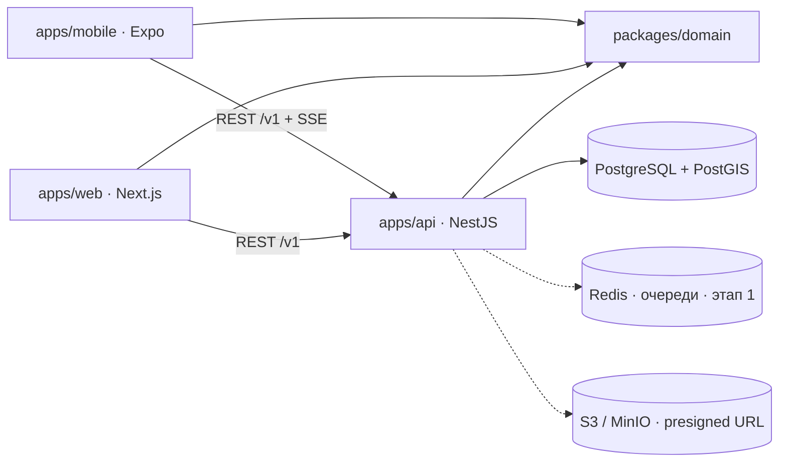

# Архитектура (текущее состояние)

Реализация рекомендаций handoff §4 — модульный монолит с одной БД и общим доменным пакетом.

## packages/domain
| Часть | Что даёт |
|---|---|
| `enums/` | Discipline, TournamentLevel/Status, RegistrationStatus, ResultStatus, Role, Visibility, LocationPrivacy, типы снастей |
| `state-machines/` | `tournamentMachine`, `registrationMachine`, `resultMachine` (handoff §7) с `assertTransition` |
| `ranking/` | `calculatePoints` по версионируемым `RankingRules`, `seasonTotal`, `projectTotals` из ledger, `scoreLengthSum` (5 рыб / ≤3 одного вида) |
| `schemas/` | zod DTO: auth, profile, tournament, registration, result, catch, gear |

## apps/api
| Модуль | Статус | Ключевое |
|---|---|---|
| `identity` | работает | OTP (hash, лимиты), JWT access + refresh-сессии с ротацией, `AuthGuard` + `RolesGuard` (scoped RBAC) |
| `users` | работает | приватный / публичный профиль (разные DTO: публичный — сезон, история стартов, подиумы, публичные комплекты; без телефона/координат/документов), дисциплины, поиск напарника, устройства для push |
| `gear` | работает | каталог, комплекты (JSON-элементы по zod-схемам), лодка, очередь custom-моделей |
| `catches` | работает | дневник → трофей, фото, геоприватность (точка raw-SQL), публичные карточки без координат |
| `tournaments` | работает | календарь, карточка, версионный регламент (+ шаблоны дисциплин), создание/редактирование/дублирование, участники, публичный список участников, ops (чек-лист допусков, бюджет, партнёры), маркеры, все результаты, лист ожидания, переходы статуса с финализацией |
| `registrations` | базово | идемпотентное создание, лист ожидания, приглашения, accept, платёж-заглушка, отмена |
| `competition` | базово | результат: draft → upload-url → submit → очередь → решение; лидерборд-снапшоты; протесты |
| `rankings` | работает | начисление в ledger, пересборка проекции, таблица |
| `notifications` | работает | in-app + Expo Push на все устройства пользователя (`infra/push`), непрочитанные, регистрация устройств |
| `admin` | работает | дашборд, пользователи/роли/блокировка, сезоны, версии правил рейтинга, ledger и ручные корректировки, виды рыб, каталог снастей (утверждение custom-моделей), модерация постов, аудит |
| `community` | работает | каналы (официальные/локальные), членство, рубрики, посты, лайки, комментарии; выезды с заявками, подбор компании, клубы с составом/заявками/слотами и клубным рейтингом |
| `infra/realtime` | SSE | `/v1/live/tournaments/:id` — in-process шина; Redis pub/sub при масштабировании |
| `infra/storage` | заглушка | контракт presigned URL стабилен, S3 SDK — этап 1 |

Все 46 маршрутов описаны в OpenAPI (`/docs`).

## apps/mobile
Экраны перенесены из HTML-прототипа один в один (UI-кит `src/components/ui.tsx` повторяет CSS-классы `#fish-prototype`). expo-router: `(tabs)` главная / турниры / рейтинг / карта / сообщество, профиль по кнопке сверху; `onboarding/`; `tournament/[id]`; `live/[id]`; `gear/*` редактор комплектов и лодка; `diary` + `catch/new`. Сессия в SecureStore (web — localStorage), refresh-ротация на 401, TanStack Query.

## apps/web
**CRM лиги.** Server Components + server actions, вход по OTP (httpOnly-cookie). Дашборд сезона (взносы, заявки, очереди); рабочее место турнира с вкладками: обзор и статусы, участники (чек-ин, номера, отклонение, CSV, лист ожидания), результаты (фото, судья, решения), протокол (CSV), протесты, маркеры, чек-лист и бюджет, карточка и регламент (шаблоны дисциплин, дублирование). Рейтинг: таблица, редактор версий правил сезона (коэффициенты ×1/×1,25/×2/×3 живут здесь), журнал начислений и ручные корректировки. Пользователи и роли (глобальные и на турнир), блокировка. Сообщество: модерация. Система: сезоны, виды рыб, каталог снастей, аудит.

## Offline (handoff §13)
`apps/mobile/src/features/results/outbox.ts`: черновик и фото сохраняются в AsyncStorage сразу, отправка идёт шагами (черновик → фото → submit) с сохранением стадии; повтор при старте, при возврате в foreground и каждые 30 с. Дубли исключены clientId и sha256 фото.

## Что сознательно отложено
- Prisma-модели для community / clubs / trips / maps / billing / shop — вне MVP (handoff §3).
- BullMQ-очереди (медиа, push, пересчёт) — после подключения S3.
- WebSocket вместо SSE — только если понадобится двунаправленный канал.
- Tie-breakers, DUEL_POINTS (форель) и PLACE_SUM (float sprint) в лидерборде.
