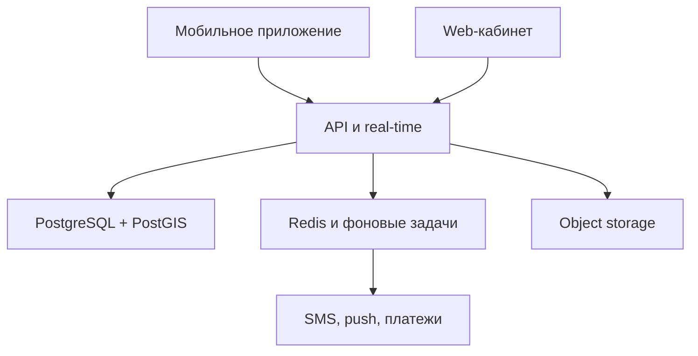
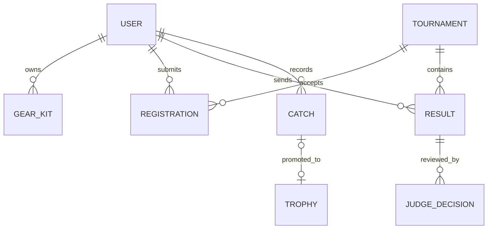
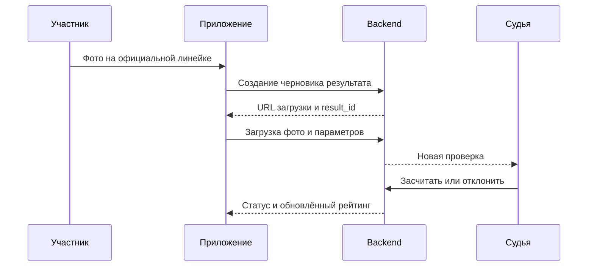

# Синдикат — техническая документация и передача в разработку

Версия документа: 1.0  
Дата: 19 сентября 2026  
Основание: актуальная концепция «Рыбалка — концепция турнирной лиги» и интерактивный HTML-прототип «Синдикат».

## 1. Назначение документа

Документ фиксирует:

- расхождения между продуктовой концепцией и текущим прототипом;
- рекомендуемую архитектуру приложения;
- ключевые сущности, роли, статусы и бизнес-процессы;
- границы MVP и последующих релизов;
- требования к API, данным, файлам, real-time и безопасности;
- порядок разработки, проверки и выпуска.

HTML-прототип является демонстрацией UX и пользовательских сценариев. Он не является готовым frontend-кодом, схемой базы данных или окончательной бизнес-логикой.

## 2. Резюме сверки

### 2.1. Что уже соответствует концепции

| Область | Статус | Комментарий |
|---|---:|---|
| Календарь сезона | Совпадает | В прототипе присутствуют 30 событий 2027 года, деление на Sprint / Qualifier / Open / Major и нерестовая пауза. |
| Дисциплины | Совпадает | Street, area trout, feeder, float, shore jig, ice и boat представлены в навигации, календаре или профиле. |
| Карточка турнира | Совпадает в основе | Есть дата, адрес, парковка, тайминг, разрешённые и запрещённые снасти, зачёт, фиксация, штрафы, протест и регламент. |
| Личный и парный формат | Совпадает | При регистрации можно выбрать личный или парный зачёт и пригласить напарника. |
| Рейтинг и лидерборды | Совпадает в основе | Есть отдельные рейтинги дисциплин, очки, место и путь к финалу. |
| Live-турнир | Совпадает в основе | Есть таймер, отправка результата, судейская очередь, live-рейтинг и протесты. |
| Цифровой контур | Совпадает | Авторизация, регистрация на турнир, фотофиксация, судейство, рейтинги и протесты выполняются внутри собственного приложения. |
| Профиль участника | Совпадает частично | Есть фото, имя, город, стаж, дисциплины, рейтинг, история участия и снаряжение. |
| Арсенал | Совпадает частично | Есть несколько комплектов, цепочка снастей, видимость и карточка лодки. |
| Юридический чек-лист | Совпадает | Отражены нерестовые окна, зимовальные ямы, ООПТ, правила вылова, владелец берега, медик и резервная дата. |
| Бережное обращение с рыбой | Совпадает | В правилах есть фотофиксация и немедленный выпуск. |

### 2.2. Критические расхождения, которые нужно утвердить до разработки

| № | Тема | Концепция MD | Текущий прототип | Рекомендация |
|---:|---|---|---|---|
| 1 | Коэффициент Qualifier | `×1` | `×1,25` | Зафиксировать одно значение. Для первой версии использовать значение из утверждённого регламента; не хранить коэффициент в коде, хранить в настройках типа турнира. |
| 2 | Urban Street Open | Формат серии: 3–4 часа; рекомендуемый пилот — 40 участников и 3 часа | 80 участников и 5 часов | Разделить «пилот» и «крупный Open». Для конкретного события явно утвердить ёмкость и продолжительность. |
| 3 | Командный зачёт Street | Указаны личный и парный форматы | Добавлен командный формат на 4 человека | Либо внести командный формат в концепцию и регламент, либо убрать его из регистрации Street. |
| 4 | Grand Final | В MD описан сезонный рейтинг, но нет точных правил допуска | В прототипе есть победители Open, лидеры рейтинга, wildcard и минимум два старта | Зафиксировать формулу допуска, квоты и правила wildcard отдельным регламентом сезона. |
| 5 | «Трофеи» | Отдельная вкладка с фото, описанием, видом, длиной, весом, снастью, гео и рекордами | Есть только упрощённый личный дневник | Добавить полноценный модуль «Трофеи»; дневник и трофеи не считать одним экраном. |
| 6 | Каталог снастей | Арсенал должен быть структурированным и подробным | Онбординг использует каталоги, но последующее редактирование снова построено на текстовых полях | Один и тот же каталог и одна схема данных должны использоваться в онбординге, профиле и редакторе арсенала. |

### 2.3. Функции из MD, которых нет или недостаточно в прототипе

#### Профиль

- предпочитаемые виды рыбы;
- домашние водоёмы или типы акваторий;
- явная история достижений и наград;
- полноценная вкладка «Трофеи»;
- связь трофея с турниром, записью дневника и комплектом;
- сортировка трофеев по виду, весу, длине и дате;
- автоматическое выделение личных рекордов.

#### Трофеи и дневник

- загрузка одной или нескольких реальных фотографий;
- вес рыбы;
- свободное описание;
- выбор снасти или комплекта, на который поймана рыба;
- геолокация с уровнями приватности: точка, только водоём, скрыто;
- привязка к турниру;
- модерация публичной карточки;
- раздельное понятие «обычная запись дневника» и «трофей».

#### Арсенал

- фото комплекта;
- тип, мощность и количество секций удилища;
- масса катушки и запасная шпуля;
- разрывная нагрузка и цвет линии;
- состояние линии и дата намотки;
- материал, диаметр и длина поводка как отдельные поля;
- электромотор и подробные характеристики лодки;
- отдельный безопасный контур хранения документов лодки;
- редактирование комплектов через те же справочники брендов и моделей, что и в онбординге.

#### Турниры

- полноценные карточки и разные правила для всех дисциплин, а не только подробно проработанный Urban Street Open;
- турнирная сетка Area Trout;
- жеребьёвка и сектора для feeder / float;
- экипажи, GPS-трек, допуск лодки и погодный протокол для Boat Predator;
- контроль безопасности льда, резервная дата и аварийный сценарий для Ice Fishing;
- ожидание места, возвраты, отмены, переносы и замена участника;
- завершённый процесс оплаты заявки.

### 2.4. Возможности прототипа, отсутствующие в концептуальном MD

Это не ошибки, но их нужно отдельно признать частью продукта и включить в бюджет:

- сообщества, каналы, рубрики, темы и модерация;
- личные сообщения;
- клубы и команды;
- поиск компании для совместной рыбалки;
- премиальная карта водоёмов и глубин;
- внешний медиараздел;
- магазин;
- кабинет организатора с бюджетом и партнёрскими пакетами;
- платная подписка;
- уведомления.

До оценки разработки необходимо определить, какие из этих модулей входят в MVP, а какие остаются только архитектурным резервом.

## 3. Предлагаемая граница MVP

### В MVP включить

1. Авторизация по телефону и согласия.
2. Профиль, дисциплины и базовый арсенал.
3. Календарь и карточки турниров.
4. Регистрация, напарник, команда и статус оплаты.
5. Управление участниками организатором.
6. Live-турнир, фотофиксация, судейская проверка и протест.
7. Рейтинг по дисциплинам и рейтинг сезона.
8. Уведомления.
9. Минимальная админ-панель и аудит действий.
10. Трофеи в базовой версии: фото, рыба, длина, вес, описание, комплект и приватность геолокации.

### После MVP

- сообщества, каналы, рубрики и личные сообщения;
- клубы и команды как социальный модуль;
- поиск компании для рыбалки;
- премиальная карта;
- расширенный медиараздел;
- магазин;
- сложные партнёрские кабинеты;
- автоматическое распознавание линейки и рыбы;
- GPS-треки лодочных турниров.

## 4. Рекомендуемая техническая архитектура

Для первого релиза рекомендуется модульный монолит. Это один backend-проект и одна база данных, но домены разделены модулями и не обращаются напрямую к внутренним таблицам друг друга. Такое решение быстрее и дешевле микросервисов, но позволяет позже вынести live-судейство, медиа или чат в отдельные сервисы.

### 4.1. Рекомендуемый стек

| Слой | Рекомендация | Назначение |
|---|---|---|
| Мобильное приложение | React Native + Expo + TypeScript | Один клиент для iOS и Android, камера, геолокация, push-уведомления, сборки и тестовые дистрибутивы. |
| Web-кабинет | Next.js + TypeScript | Организаторы, судьи, модераторы, поддержка и контент-менеджеры. |
| Backend | NestJS + TypeScript | REST API, WebSocket/SSE, фоновые задачи, RBAC и модульная структура. |
| Основная БД | PostgreSQL | Пользователи, турниры, заявки, результаты, рейтинги, сообщества и транзакционные данные. |
| Геоданные | PostGIS | Водоёмы, турнирные зоны, точки сбора, скрытые геопозиции и пространственный поиск. |
| Кэш и очереди | Redis + очередь задач | OTP, rate limit, кэш лидербордов, уведомления, обработка медиа и пересчёт рейтинга. |
| Файлы | S3-совместимое object storage | Фото профилей, результатов, трофеев, регламенты и медиа. |
| Real-time | WebSocket или SSE | Live-рейтинг, статусы проверки результата и судейская очередь. |
| Контракты | OpenAPI | Генерация типизированного клиента и единая документация API. |
| Наблюдаемость | Структурированные логи, ошибки, метрики и tracing | Диагностика отправки результатов, оплат и real-time событий. |

Expo документирует единый TypeScript-проект для iOS, Android и web, а также API камеры и уведомлений. NestJS имеет штатные модули для WebSocket, очередей, загрузки файлов, авторизации и OpenAPI. PostgreSQL подходит для транзакционных сущностей, а PostGIS — для географических данных и пространственных запросов.

### 4.2. Общая схема

### 4.3. Backend-модули

| Модуль | Ответственность |
|---|---|
| Identity | OTP, сессии, refresh-токены, устройства, блокировки и согласия. |
| Users | Профиль, дисциплины, город, стаж, приватность и настройки. |
| Gear | Каталог брендов/моделей, комплекты, элементы снастей, лодки и видимость. |
| Trophies | Трофеи, фото, параметры рыбы, геоприватность, рекорды и связи. |
| Tournaments | События, дисциплины, правила, зоны, расписание, документы и статусы. |
| Registrations | Заявки, напарники, команды, лист ожидания, допуски и оплаты. |
| Competition | Стартовые номера, маркеры, результаты, судейство, протесты и протокол. |
| Rankings | Очки, коэффициенты, сезоны, дисциплины, снапшоты и пересчёт. |
| Community | Каналы, рубрики, публикации, комментарии и модерация. |
| Clubs | Клубы, команды, составы, роли и приглашения. |
| Trips | Совместные выезды, места, заявки и поиск компании. |
| Maps | Водоёмы, слои глубин, точки, права доступа и подписка. |
| Billing | Платежи, возвраты, чеки, подписки и webhook-процессы. |
| Notifications | Push, SMS, in-app, шаблоны и предпочтения пользователя. |
| Admin | RBAC, аудит, справочники, жалобы и служебные операции. |

## 5. Роли и права

| Роль | Основные права |
|---|---|
| Гость | Просмотр публичного календаря, правил и публичных профилей. |
| Пользователь | Профиль, арсенал, трофеи, сообщества и выезды. |
| Участник | Регистрация, оплата, загрузка результата и подача протеста. |
| Капитан клуба | Состав, приглашения, заявки команды и внутренние объявления. |
| Владелец канала | Настройки канала, рубрики, назначение локальных ролей. |
| Модератор | Жалобы, скрытие контента и временные ограничения. |
| Судья | Проверка назначенных результатов и запрос повторного фото. |
| Главный судья | Финальное решение, протесты, корректировки протокола. |
| Организатор | Настройка турнира, участники, зоны, документы, бюджет и публикация. |
| Поддержка | Восстановление доступа, выдача ролей и разбор обращений. |
| Системный администратор | Глобальные настройки, справочники, аудит и аварийные операции. |

Права должны проверяться backend-сервисом. Скрытие кнопки на клиенте не считается ограничением доступа.

## 6. Основная модель данных

### 6.1. Пользователь и профиль

- `users`: id, phone, status, created_at, last_seen_at;
- `user_profiles`: user_id, display_name, avatar_file_id, city_id, experience_years, bio;
- `user_disciplines`: user_id, discipline_id, priority;
- `user_target_species`: user_id, fish_species_id;
- `user_home_waters`: user_id, waterbody_id или water_type;
- `consents`: user_id, type, version, accepted_at, source;
- `user_roles`: user_id, role, scope_type, scope_id;
- `devices`: user_id, push_token, platform, last_seen_at.

### 6.2. Арсенал

- `gear_kits`: owner_id, name, discipline_id, target_species, purpose, is_primary, visibility, photo_file_id, comment;
- `rods`: type, brand_id, model_id, length_mm, lure_test_min_g, lure_test_max_g, action, power, sections;
- `reels`: type, brand_id, model_id, size, gear_ratio, weight_g, spare_spool;
- `main_lines`: type, brand_id, model_id, diameter_mm, pe_size, breaking_load_lb, color, installed_at, condition;
- `leaders`: material, brand_id, model_id, diameter_mm, length_cm, breaking_load_lb;
- `lures`: type, brand_id, model_id, weight_g, color, comment;
- `boats`: type, brand_id, model_id, length_cm, material, seats, capacity_kg, availability;
- `boat_equipment`: motor, electric_motor, sonar, trailer;
- `gear_catalog_brands` и `gear_catalog_models`: управляемые справочники;
- `gear_custom_requests`: пользовательские модели, которых нет в каталоге.

Каталог не должен блокировать пользователя. В каждом справочнике нужен вариант «другая модель», после которого запись попадает в очередь нормализации администратору.

### 6.3. Трофеи

- `catches`: owner_id, fish_species_id, length_mm, weight_g, description, caught_at;
- `catch_media`: catch_id, file_id, sort_order;
- `catch_gear_links`: catch_id, gear_kit_id, lure_id, free_text;
- `catch_locations`: catch_id, point, waterbody_id, privacy_mode;
- `trophies`: catch_id, status, is_personal_record, record_type;
- `catch_tournament_links`: catch_id, tournament_id, result_id;

Рекомендуется единая сущность `catch`: обычная запись дневника может быть отмечена как трофей. Это исключает дублирование фотографий и параметров.

### 6.4. Турниры и регистрация

- `seasons`, `disciplines`, `tournament_types`;
- `tournaments`: название, тип, дисциплина, коэффициент, ёмкость, статус, даты;
- `tournament_locations`: адрес, точка сбора, парковка, зона/маршрут, геометрия;
- `tournament_rules`: версия, формат зачёта, разрешения, запреты и штрафы;
- `tournament_documents`: регламент, версия, published_at;
- `registrations`: tournament_id, owner_id, format, status, amount, currency;
- `registration_members`: registration_id, user_id, role, invitation_status;
- `payments`: registration_id, provider_id, status, amount, paid_at;
- `admissions`: registration_id, type, status, checked_by;
- `waitlist_entries`: tournament_id, user_id, position;

### 6.5. Соревнование и рейтинг

- `competition_markers`: tournament_id, code, valid_from, valid_to;
- `results`: tournament_id, participant_id, species_id, length_mm, weight_g, status, submitted_at;
- `result_media`: result_id, file_id, checksum, metadata;
- `judge_decisions`: result_id, judge_id, decision, reason, created_at;
- `protests`: tournament_id, author_id, target_type, target_id, status, deadline_at;
- `leaderboard_snapshots`: tournament_id, generated_at, payload/version;
- `ranking_rules`: season_id, discipline_id, version, coefficients, tie_breakers;
- `ranking_entries`: user_id, season_id, discipline_id, points, rank;
- `ranking_ledger`: immutable source events for every points change.

## 7. Статусы и бизнес-процессы

### 7.1. Турнир

`DRAFT → INTERNAL_REVIEW → PUBLISHED → REGISTRATION_OPEN → REGISTRATION_CLOSED → LIVE → JUDGING → FINALIZED → ARCHIVED`

Дополнительные состояния: `POSTPONED`, `CANCELLED`.

После `FINALIZED` изменения результата выполняются только через корректирующую запись с автором и причиной. Перезаписывать историю нельзя.

### 7.2. Заявка

`DRAFT → WAITING_MEMBERS → WAITING_PAYMENT → CONFIRMED → CHECKED_IN → FINISHED`

Альтернативные состояния: `WAITLISTED`, `PAYMENT_FAILED`, `CANCELLED`, `REFUND_PENDING`, `REFUNDED`, `REJECTED`.

### 7.3. Результат

`DRAFT → UPLOADING → SUBMITTED → AUTO_CHECKED → PENDING_JUDGE → ACCEPTED`

Ветки: `NEEDS_RESUBMISSION`, `REJECTED`, `UNDER_PROTEST`, `CORRECTED`.

### 7.4. Отправка результата

## 8. API-контуры

API версионируется префиксом `/v1`. Все изменяющие запросы должны поддерживать `Idempotency-Key`, особенно регистрация, оплата и отправка результата.

### Identity и профиль

- `POST /v1/auth/otp/request`
- `POST /v1/auth/otp/verify`
- `POST /v1/auth/refresh`
- `GET /v1/me`
- `PATCH /v1/me/profile`
- `PUT /v1/me/disciplines`
- `POST /v1/me/avatar/upload-url`

### Арсенал и трофеи

- `GET /v1/gear/catalog?type=rod&query=`
- `POST /v1/me/gear-kits`
- `PATCH /v1/me/gear-kits/{id}`
- `DELETE /v1/me/gear-kits/{id}`
- `POST /v1/me/catches`
- `POST /v1/me/catches/{id}/media/upload-url`
- `POST /v1/me/catches/{id}/promote-to-trophy`
- `GET /v1/users/{id}/trophies`

### Турниры

- `GET /v1/tournaments`
- `GET /v1/tournaments/{id}`
- `GET /v1/tournaments/{id}/rules`
- `POST /v1/tournaments/{id}/registrations`
- `POST /v1/registrations/{id}/members/invite`
- `POST /v1/registrations/{id}/payments`
- `GET /v1/registrations/{id}`

### Live и судейство

- `POST /v1/tournaments/{id}/results`
- `POST /v1/results/{id}/media/upload-url`
- `POST /v1/results/{id}/submit`
- `POST /v1/results/{id}/judge-decisions`
- `POST /v1/tournaments/{id}/protests`
- `GET /v1/tournaments/{id}/leaderboard`
- `GET /v1/rankings?season=&discipline=`
- WebSocket/SSE: `/v1/live/tournaments/{id}`

### Администрирование

- CRUD турниров, правил, зон, документов и коэффициентов;
- управление участниками, листом ожидания и допусками;
- судейская очередь;
- обработка протестов;
- справочники снастей и рыб;
- роли, жалобы и журнал аудита.

## 9. Файлы, фотографии и приватность

1. Клиент запрашивает одноразовый URL загрузки.
2. Файл отправляется напрямую в object storage.
3. Backend получает подтверждение, проверяет MIME, размер, checksum и принадлежность.
4. Фоновая задача создаёт уменьшенные копии, удаляет опасные метаданные и запускает проверки.
5. В БД хранится идентификатор файла, а не публичная ссылка.
6. Доступ выдаётся короткоживущими подписанными URL с учётом прав.

Для турнирных фото отдельно хранить исходник, checksum, время загрузки, участника, турнир, маркер и историю решений. Для геолокации трофея точная координата никогда не должна попадать в публичный API, если режим приватности — `WATERBODY_ONLY` или `HIDDEN`.

## 10. Рейтинг

Формула рейтинга должна быть версионируемой. В коде нельзя жёстко зашивать `×1`, `×1,25`, `×2` или `×3`.

Минимальная модель:

`points = base_points(place, field_size) × event_coefficient × discipline_coefficient + bonuses - penalties`

Нужно заранее определить:

- коэффициенты типов турниров;
- минимальное количество стартов;
- количество лучших результатов сезона;
- правила ничьей;
- переход между дисциплинами;
- командные очки;
- wildcard;
- момент заморозки результата;
- правила перерасчёта после протеста.

Каждое начисление записывается в `ranking_ledger`. Текущая таблица рейтинга является вычисляемой проекцией, которую можно пересобрать.

## 11. Интеграции

| Интеграция | Требование |
|---|---|
| SMS / звонок | Абстракция провайдера, лимиты, антифрод, повторная отправка и резервный провайдер. |
| Платежи | Создание платежа, webhook, идемпотентность, возвраты, сверка и чеки. |
| Push | Напоминания о турнире, приглашения, статус результата, протест и изменение расписания. |
| Карты | Геокодинг адреса, отображение зон, приватные координаты и PostGIS. |
| Аналитика | Согласованный список событий без отправки чувствительных координат и документов. |

## 12. Нефункциональные требования

- API p95 для обычных чтений: до 500 мс без учёта внешних интеграций.
- Live-обновление принятого результата: до 3 секунд после судейского решения.
- Загрузка результата должна переживать слабую связь и уметь продолжаться после восстановления сети.
- Все даты хранятся в UTC; локальная зона события хранится отдельно.
- Денежные суммы хранятся в минимальных единицах целым числом.
- Резервное копирование БД и проверяемое восстановление.
- Аудит критических действий организатора, судьи и поддержки.
- Rate limit для OTP, сообщений, публикаций и загрузок.
- Шифрование трафика и чувствительных данных.
- Удаление аккаунта и политика хранения данных должны быть согласованы до релиза.
- Публичные и приватные данные должны иметь разные DTO и запросы.

## 13. Offline и плохая связь

На водоёмах связь нестабильна, поэтому это требование относится к MVP:

- черновик результата сохраняется локально;
- фотография не теряется при закрытии экрана;
- загрузка повторяется автоматически;
- пользователь видит состояния «на устройстве», «загружается», «отправлено», «принято сервером»;
- сервер защищён от дублей через idempotency key и checksum;
- судья видит только полностью загруженные результаты;
- дедлайн определяется серверным временем, но учитывает результат, начатый до дедлайна по правилам турнира.

## 14. Процесс разработки

### Этап 0. Product freeze

Результат этапа:

- утверждён список MVP;
- приняты шесть решений из раздела критических расхождений;
- утверждены роли;
- утверждены статусы заявок, результатов и турниров;
- зафиксирована формула рейтинга;
- подготовлены регламенты для минимум двух дисциплин;
- утверждены поставщики SMS, платежей, карт и файлового хранения.

### Этап 1. Технический фундамент

- репозитории и правила ветвления;
- окружения `dev`, `stage`, `prod`;
- CI: lint, typecheck, unit tests, build и миграции;
- базовый мониторинг и журнал аудита;
- Identity, профиль, роли и object storage;
- дизайн-токены и библиотека компонентов.

### Этап 2. Турниры и регистрация

- календарь и фильтры;
- карточка турнира и версионный регламент;
- личная, парная и утверждённая командная регистрация;
- приглашение напарника;
- оплата, лист ожидания, отмена и возврат;
- кабинет участника и организатора.

### Этап 3. Live, судейство и рейтинг

- выдача маркера;
- offline-устойчивая загрузка фото;
- очередь судей;
- решения и запрос повторной фотографии;
- live-лидерборд;
- протесты;
- финализация и рейтинг сезона.

### Этап 4. Профиль, арсенал и трофеи

- нормализованный каталог снастей;
- несколько комплектов;
- лодка и приватные документы;
- дневник;
- трофеи, рекорды, сортировка и геоприватность.

### Этап 5. Социальные функции

- каналы, рубрики, публикации и комментарии;
- клубы и команды;
- личные сообщения;
- поиск компании и совместные выезды;
- модерация и жалобы.

### Этап 6. Платные и будущие модули

- подписка;
- карта водоёмов и глубин;
- медиараздел;
- магазин;
- партнёрские кабинеты.

## 15. Организация работы команды

### Обязательные артефакты на каждую функцию

1. User story и бизнес-цель.
2. Макет и все состояния экрана.
3. API-контракт.
4. Изменение схемы данных и миграция.
5. Матрица прав.
6. Аналитические события.
7. Ошибки и пустые состояния.
8. Unit-, integration- и end-to-end-тесты.
9. План отката или feature flag.

### Definition of Ready

Задача готова к разработке, если понятны пользователь, цель, макет, бизнес-правила, права, данные, API, ошибки и критерии приёмки.

### Definition of Done

- код прошёл review;
- миграции проверены вперёд и назад;
- API описан в OpenAPI;
- есть автоматические тесты;
- проверены права доступа;
- добавлены логи и метрики;
- тексты и ошибки согласованы;
- функция проверена на stage на iOS и Android;
- нет блокирующих дефектов;
- документация обновлена.

## 16. Тестирование

### Unit

- расчёт рейтинга;
- дедлайны регистрации и протестов;
- переходы статусов;
- видимость снастей и геолокации;
- проверка допуска;
- правила подсчёта рыбы.

### Integration

- OTP и сессия;
- регистрация + приглашение + оплата;
- загрузка фото + судейское решение;
- webhook платежа;
- финализация турнира + перерасчёт рейтинга;
- возврат и освобождение места;
- выдача приватного файла по ролям.

### End-to-end

1. Новый пользователь проходит онбординг и создаёт комплект.
2. Участник регистрируется лично и оплачивает участие.
3. Участник создаёт пару и ждёт подтверждения напарника.
4. Организатор закрывает регистрацию и выдаёт номера.
5. Участник при слабой связи отправляет результат.
6. Судья принимает результат, лидерборд обновляется.
7. Участник подаёт протест, главный судья выносит решение.
8. Турнир финализируется, очки появляются в рейтинге.
9. Пользователь создаёт трофей и скрывает точную геолокацию.

## 17. Приёмка MVP

MVP можно считать готовым к пилоту, если:

- новый пользователь проходит путь от OTP до заполненного профиля;
- пользователь может создать и отредактировать минимум два комплекта;
- организатор создаёт турнир без вмешательства разработчика;
- участник регистрируется, приглашает напарника и видит статус оплаты;
- судья принимает и отклоняет результаты с причиной;
- live-рейтинг обновляется без ручной перезагрузки;
- протест проходит полный жизненный цикл;
- финальный протокол нельзя незаметно изменить;
- рейтинг можно полностью пересчитать из журнала операций;
- фото не теряются при нестабильной сети;
- приватная геопозиция и документы лодки недоступны постороннему пользователю;
- все критические операции видны в аудите.

## 18. Решения, которые нужны от владельца продукта

1. Коэффициент Qualifier: `×1` или `×1,25`.
2. Параметры Urban Street Open: 3–4 или 5 часов, 40 или 80 участников.
3. Нужен ли командный зачёт в Street.
4. Точные правила Grand Final и wildcard.
5. Входит ли вкладка «Трофеи» в MVP.
6. Какие социальные функции входят в первый релиз.
7. Нужна ли платная карта в первой версии.
8. Где проходит граница между дневником, трофеем и турнирным результатом.

## 19. Источники по предлагаемому стеку

- [Expo documentation](https://docs.expo.dev/)
- [NestJS WebSocket gateways](https://docs.nestjs.com/websockets/gateways)
- [PostgreSQL JSON types](https://www.postgresql.org/docs/current/datatype-json.html)
- [PostGIS documentation](https://postgis.net/documentation/)
